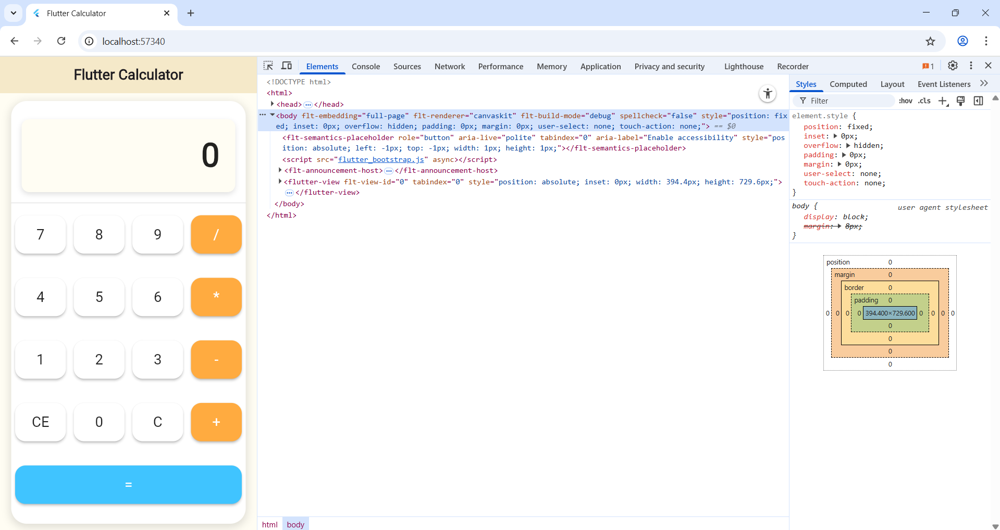

# 🧮 Flutter Calculator

A simple calculator built using **Flutter** for **Lab 2: Create a Calculator Application**  
(CSD228 – Mobile Web Development, Sault College)

---

## ✨ Features
- Performs **Addition**, **Subtraction**, **Multiplication**, and **Division**
- Includes **CE (Clear Entry)** and **C (Clear)** buttons
- Responsive layout for web and mobile
- Clean and modern design
- Persistent state using **SharedPreferences**

---

## 🖼️ Preview


---

## ⚙️ How to Run
1. Clone this repository:
   ```bash
   git clone https://github.com/ekjotkaursault/flutter_calculator.git
